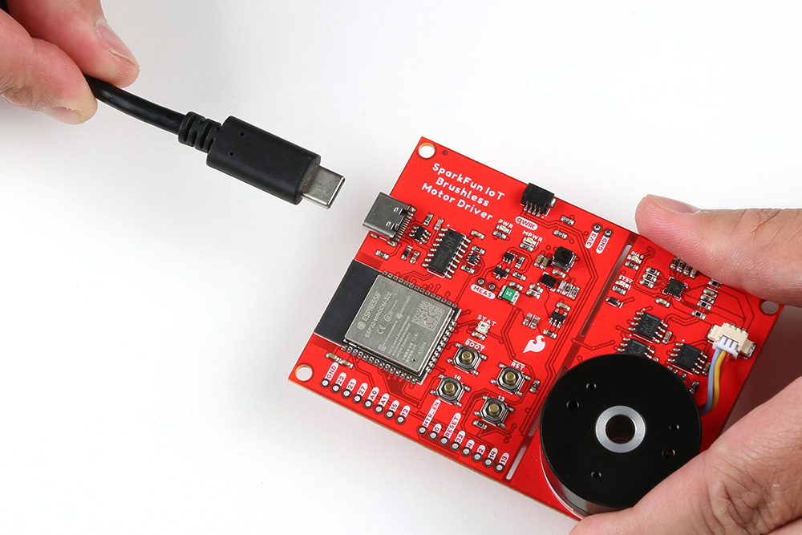
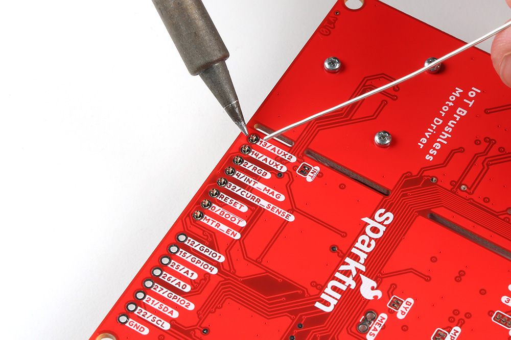
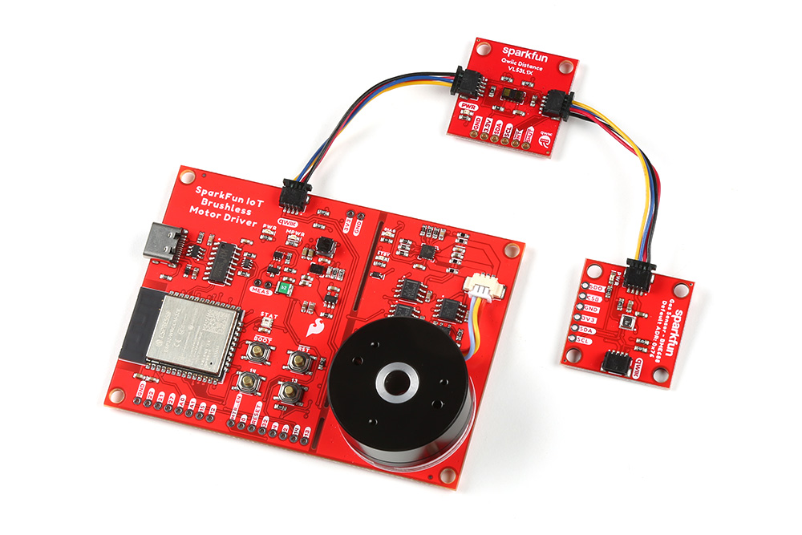

## USB Programming
The USB connection is utilized for programming and serial communication. Users only need to plug their IoT Motor Driver into a computer using a USB-C cable.

<figure markdown>
[{ width="400" }](./assets/img/hookup_guide/assembly_usb.jpg "Click to enlarge")
<figcaption markdown>The IoT Motor Driver with USB-C cable attached.</figcaption>
</figure>

## Headers
??? note "New to soldering?"
	If you have never soldered before or need a quick refresher, check out our [How to Solder: Through-Hole Soldering](https://learn.sparkfun.com/tutorials/how-to-solder-through-hole-soldering) guide.

	

	-   <a href="https://learn.sparkfun.com/tutorials/5">
		<figure markdown>
		
		</figure>

		---
		
		**How to Solder: Through-Hole Soldering**</a>

	

The pins for the IoT Motor Driver are broken out into 0.1"-spaced pins on the outer edges of the board. When selecting headers, be sure you are aware of the functionality you require.

<figure markdown>
[{ width="400" }](./assets/img/hookup_guide/assembly_headers.jpg "Click to enlarge")
<figcaption markdown>Soldering headers to the IoT Motor Driver.</figcaption>
</figure>

### Qwiic Devices
The Qwiic system allows users to effortlessly prototype with a Qwiic compatible I2C device without soldering. Users can attach any Qwiic compatible [sensor or board](https://www.sparkfun.com/qwiic#sensors), with just a [Qwiic cable](https://www.sparkfun.com/products/15081). (*\*The example below, is for demonstration purposes and is not pertinent to the board functionality or this tutorial.*)

<figure markdown>
[{ width="400" }](./assets/img/hookup_guide/assembly_qwiic.jpg "Click to enlarge")
<figcaption markdown>The [BME688 environmental](https://www.sparkfun.com/products/19096) and [VL53L1X distance](https://www.sparkfun.com/products/14722) Qwiic sensor boards connected to the IoT Motor Driver.</figcaption>
</figure>