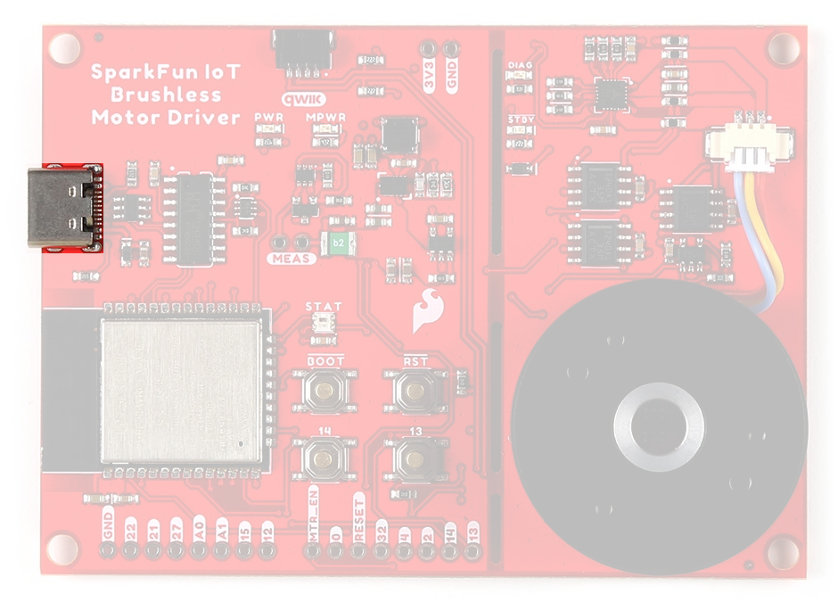
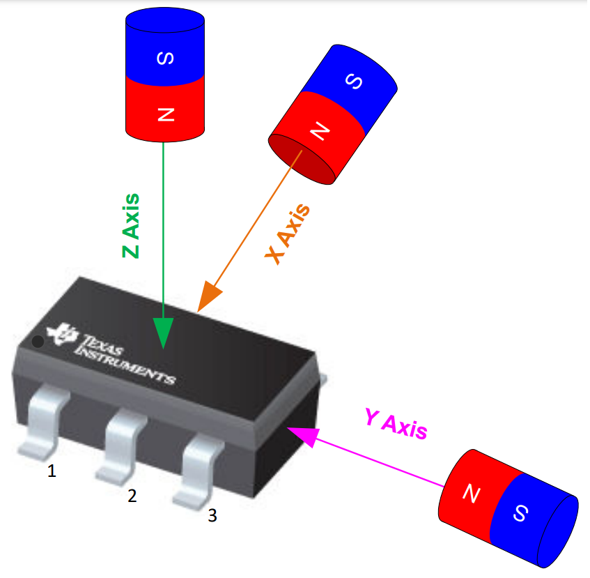

## Board Dimensions
The board dimensions are illustrated in the drawing below; the listed measurements are in inches.

<figure markdown>
[{ width="400" }](./assets/img/hookup_guide/dimensions.png "Click to enlarge")
<figcaption markdown>
[Board dimensions (PDF)](./assets/board_files/dimensions.pdf) for the IoT Motor Driver board, in inches.
</figcaption>
</figure>

??? tip "Need more measurements?"
	For more information about the board's dimensions, users can download the [eagle files](./assets/board_files/eagle_files.zip) for the board. These files can be opened in Eagle and additional measurements can be made with the dimensions tool.

	??? info ":octicons-download-16:{ .heart } Eagle - Free Download!"
		Eagle is a [CAD]("computer-aided design") program for electronics that is free to use for hobbyists and students. However, it does require an account registration to utilize the software.

		

		[Download from :autodesk-primary:{ .autodesk }](https://www.autodesk.com/products/eagle/free-download "Go to downloads page"){ .md-button .md-button--primary width="250px" }
		

	
	??? info ":straight_ruler: Dimensions Tool"
		This video from Autodesk demonstrates how to utilize the dimensions tool in Eagle, to include additional measurements:

		

		

		<iframe src="https://www.youtube.com/embed/dZLNd1FtNB8" title="EAGLE Dimension Tool" frameborder="0" allow="accelerometer; autoplay; clipboard-write; encrypted-media; gyroscope; picture-in-picture" allowfullscreen></iframe>
		

		{ .qr }
		

## USB-C Connector
The USB connector is provided to power and program the board. For most users, it will be the primary programming interface for the ESP32 module on the IoT Motor Driver board.

<figure markdown>
[{ width="400" }](./assets/img/hookup_guide/usb_connector.jpg "Click to enlarge")
<figcaption markdown>USB-C connector on the IoT Motor Driver board.</figcaption>
</figure>

### Power
The IoT Motor Driver only requires **5V** to power all of the board's components. The simplest method to power the board is through the USB-C connector. Alternatively, the `3V3` pin can be used to supply power to any of the components, except the motor driver.

<figure markdown>
[{ width="400" }](./assets/img/hookup_guide/power_connections.jpg "Click to enlarge")
<figcaption markdown>IoT Motor Driver power connections.</figcaption>
</figure>

Below, is a general summary of the power circuitry on the board:

* **`3V3`** - Provides a regulated 3.3V from the USB (5V) power to the board, excluding the TMC6300 motor driver.
	* Used to power the ESP32-WROOM module, hall-effect and current sensors, CH340C Serial-to-UART bridge, Qwiic connector, and the WS2812 RGB LED.
	* The **3.3V** [AP2112](./assets/component_documentation/AP2112.pdf) LDO regulator can source up to 600mA.
	* Broken out as [PTH](https://en.wikipedia.org/wiki/Through-hole_technology "Plated Through Holes") pin.
* **`3V3_A`** - Provides a regulated 3.3V from the USB (5V) power to only the TMC6300 motor driver.
	* The motor driver will not function without power from the USB connector.
	* The **3.3V** [AP63357](./assets/component_documentation/AP63356-AP63357.pdf) LDO regulator can source up to 3.5A.
* **`VUSB`** - The voltage from the USB-C connector, usually **5V**.
	* Power source for the entire board.
		* Powers the two 3.3V voltage regulators (AP2112 and AP63357).
	* Features reverse current protection and a thermal fuse.
	* `MEAS` - These pins can be used to measure the current being drawn through the USB connector *(see the **[Jumpers](#jumpers)** section)*.
* **`GND`** - The common ground or the 0V reference for the voltage supplies.
* **Qwiic Connector** - Provides a regulated 3.3V voltage to the Qwiic devices.

!!! info
	For more details, users can reference the [schematic](./assets/board_files/schematic.pdf) and the datasheets of the individual components on the board.

??? warning "Motor Voltage"
	The [Gimbal Stabilizer Motor](https://cdn.sparkfun.com/assets/e/b/2/8/3/OT-EM3215_DC_Brushless_Gimbal_Motor_3_Phase_Datasheet.pdf) has an operating voltage range of 6 - 8V. However, we have found that it still functions properly with only 3.3V provided by the IoT Motor Driver board.

### CH340 Serial-to-UART
The CH340 allows the ESP32-WROOM to communicate with a computer/host device through the board's USB-C connection. This allows the board to show up as a device on the serial (or COM) port of the computer. Users will need to install the latest drivers for the computer to recognize the board *(see [**Software Overview**](/SparkFun_IoT_Brushless_Motor_Driver/software_overview/#ch340-driver) section)*.

## :fontawesome-solid-microchip:&nbsp;Microcontroller - ESP32-WROOM
The brains of the IoT Motor Driver, is an [ESP32-WROOM module](./assets/component_documentation/esp32-wroom-32e_datasheet_en.pdf) with 16MB of flash memory. Espressif's ESP32-WROOM module is a versatile, WiFi+BT+BLE MCU module that targets a wide variety of applications. At the core of this module is the ESP32-D0WDQ6 system on a chip (SoC) which is designed to be both scalable and adaptive microcontroller. Its laundry list of features include:

-	 Features:

	* Xtensa® Dual-Core 32-bit LX6 Microprocessor *(up to 240MHz)*
		* 448KB ROM and 520KB SRAM
		* 16MB of Embedded SPI Flash Storage
	* Cryptographic Hardware Accelerators
		* AES, SHA2, ECC, RSA-4096
	* Integrated 802.11 b/g/n WiFi 2.4GHz Transceiver *(up to 150Mbps)*
	* Integrated dual-mode Bluetooth (Bluetooth v4.2 and BLE)
	* 26 GPIO *(including strapping pins)*
		* 8x Capacitive Touch Electrodes
	* Operating Voltage: **3.0 to 3.6V**
		* WiFi: 380mA *(peak)*
		* Light-Sleep: 800&micro;A
		* Deep-Sleep: 10 - 150&micro;A

-	<figure markdown>
	[{ width="400" }](./assets/img/hookup_guide/esp32_module.jpg "Click to enlarge")
	<figcaption markdown>ESP32-WROOM module on the IoT Motor Driver.</figcaption>
	</figure>

!!! warning
	Users should be aware of the following nuances and details of this board

	* The ESP32-WROOM is only compatible with **2.4GHz WiFi** networks; it will not work on the 5GHz bands.
	* For details on the boot mode configuration, please refer to [section **3.3 Strapping Pins**](./assets/component_documentation/esp32-wroom-32e_datasheet_en.pdf#8) of the ESP32-WROOM module datasheet.

!!! info
	The ESP32-WROOM module has various power modes:

	* **Active** - The chip radio is powered on. The chip can receive, transmit, or listen.
	* **Modem Sleep** - The CPU is operational and the clock is configurable. The Wi-Fi/Bluetooth
	baseband and radio are disabled.
	* **Light Sleep** - The CPU is paused. The RTC memory and RTC peripherals, as well as the ULP
	coprocessor are running.
	* **Deep Sleep** - Only the RTC memory and RTC peripherals are powered on. The ULP coprocessor is functional.
	* **Hibernation** - Only one RTC timer on the slow clock and certain RTC GPIOs are
	active.
	* **Off** - Chip is powered off
	
	*For more information on the power management of the ESP32-WROOM module, pleaser refer to **Section 3.7** and **Tables: 8 and 17** of the [ESP32 SoC Datasheet](./assets/component_documentation/esp32_soc_datasheet_en.pdf).*

### Debugging
For users interested in debugging their code, the [JTAG pins](https://docs.espressif.com/projects/esp-idf/en/latest/esp32/api-guides/jtag-debugging/configure-other-jtag.html#configure-hardware) are broken out on the board. However, the debugging feature is only available through the [ESP-IDF](https://docs.espressif.com/projects/esp-idf/en/latest/esp32/api-guides/jtag-debugging/index.html?highlight=jtag).

* **`TMS`**: `GPIO 14`
* **`TDI`**: `GPIO 12`
* **`TCK`**: `GPIO 13`
* **`TDO`**: `GPIO 15`

<figure markdown>
[{ width="400" }](./assets/img/hookup_guide/jtag_pins.jpg "Click to enlarge")
<figcaption markdown>The JTAG pins of the ESP32-WROOM module on the IoT Motor Driver.</figcaption>
</figure>

### Firmware Download Mode
Users can manually force the board into the [serial bootloader](https://docs.espressif.com/projects/esptool/en/latest/esp32/advanced-topics/boot-mode-selection.html#select-bootloader-mode) with the ++"BOOT"++ button. Please, refer to the [**Boot Button** section](#boot-button) below for more information.

### Peripherals and I/O
!!! warning
	Users should be aware of the following nuances of this board

	* &#9889; All the GPIO on the IoT Motor Driver are **3.3V** pins.
		* The I/O pins are <strong>not 5V-tolerant</strong>! To interface with higher voltage components, a **[logic level adapter](https://learn.sparkfun.com/tutorials/bi-directional-logic-level-converter-hookup-guide)** is recommended.
	* &#9889; There are electrical limitations to the amount of current that the ESP32-WROOM module can sink or source. For more details, check out the [ESP32-WROOM module datasheet](./assets/component_documentation/esp32-wroom-32e_datasheet_en.pdf).
	* There are some limitations to the ADC performance, see the <b>Note</b> from the [**ADC Characteristics** section of the ESP32 SoC datasheet](./assets/component_documentation/esp32_soc_datasheet_en.pdf).

The ESP32-WROOM module has *26 multifunctional GPIO*, of which, **16 I/O pins** are used to interface with motor driver, sensors, and status LED on the board. Additionally, **13 I/O pins** are broken out to [PTH](https://en.wikipedia.org/wiki/Through-hole_technology "Plated Through Holes") pins and the users buttons. All of the [IoT Motor Driver](https://www.sparkfun.com/products/22132) pins have a .1" pitch spacing for headers.

While all of the GPIO pins are capable of functioning as digital I/O pins, various pins can have additional capabilities with the [pin multiplexing](https://docs.espressif.com/projects/arduino-esp32/en/latest/tutorials/io_mux.html?#id1) feature of the ESP32 SoC. For more technical specifications on the **I/O** pins, please refer to the [ESP32 SoC datasheet](./assets/component_documentation/esp32_soc_datasheet_en.pdf).

* 13x 12-bit analog to digital converter (ADC) channels
* 3x UARTs (only two are configured by default in the Arduino IDE, one UART is used for bootloading/debug)
* 3x SPI (only one is configured by default in the Arduino IDE)
* 2x I2C (only one is configured by default in the Arduino IDE)
* 2x I2S Audio
* 2x digital-to-analog converter (DAC) channels
* 16x 20-bit PWM outputs
* 8x Capacitive Touch Inputs

!!! info
	Users should be aware of the following limitations for the board in the Arduino IDE.

	* Not all of the features, listed above, are available in the Arduino IDE. For the full capabilities of the ESP32, the Espressif IDF should be utilized.
		* Only one I2C bus is defined.
		* Only two UART interfaces are available.
			* **UART (USB):** `Serial`
			* **`RX`/`TX` Pins:** `Serial1`
		* Only one SPI bus is defined.

#### Peripheral Devices
This development board features several components operating together to create an IoT device. Their connections are shown in the diagram below and their operations are listed in the boxes below. *For more details on each component, please refer to the sections below.*

<figure markdown>
[{ width="400" }](./assets/img/hookup_guide/block_diagram.png "Click to enlarge")
<figcaption markdown>Block diagram of the IoT Motor Driver board's peripherals.</figcaption>
</figure>

-   **Inputs**

	---

	* TMC6300 Motor Driver
		* Diagnostic Pin
	* TMAG5273 Hall-Effect Sensor
	* INA240 Current-Sense Amplifier
	* MCP6021 Operational Amplifier
	* User Buttons

-   **Outputs**

	---

	* TMC6300 Motor Driver
		* Half-Bridge Pins
		* Standby Pin
	* RGB Status LED

#### Pin Functionality
There are several pins that have special functionality in addition to general **digital I/O**. These pins and their additional functions are listed in the tabs below. For more technical specifications on the **I/O** pins, you can refer to the [schematic](./assets/board_files/schematic.pdf), [ESP32-WROOM module datasheet](./assets/component_documentation/esp32-wroom-32e_datasheet_en.pdf), [ESP32 SoC datasheet](./assets/component_documentation/esp32_soc_datasheet_en.pdf), and [documentation for the ESP32 Arduino core](https://docs.espressif.com/projects/arduino-esp32/en/latest/tutorials/io_mux.html?#peripherals).

=== "Digital I/O Pins"
	Any GPIO pin on the ESP32-WROOM module can function as a digital I/O *(input or output)*. However, users will need to declare the [**`pinMode()`** *(link)*](https://www.arduino.cc/reference/en/language/functions/digital-io/pinmode/) in the setup of their <b>sketch</b> (programs written in the Arduino IDE) to configure a pin as an input or an output.

	

	-   **Inputs**

		---

		When configured properly, an <b>input</b> pin will be looking for a <b>HIGH</b> or <b>LOW</b> state. <b>Input</b> pins are <b>High Impedance</b> and takes very little current to move the input pin from one state to another.

		

		| **`DIAG` *(TMC6300)*** | `GPIO 34` |
		| :--------------------- | :-------- |
		| **`INT` *(TMAG5273)*** | `GPIO 04` |
		| **Button ++"13"++**    | `GPIO 13` |
		| **Button ++"14"++**    | `GPIO 14` |

		

	-   **Outputs**

		---

		When configured as an <b>output</b> the pin will be at a <b>HIGH</b> or <b>LOW</b> voltage. <b>Output</b> pins are <b>Low Impedance</b>: This means that they can provide a relatively substantial amount of current to other circuits.

		

		| **`VIO` *(TMC6300)*** | `GPIO 05` |
		| :-------------------- | :-------- |
		| **WS2812**            | `GPIO 02` |

		

		!!! warning
			**&#9889;** There are electrical limitations to the amount of current that the ESP32-WROOM module can sink or source. For more details, check out the <a href="./assets/component_documentation/esp32-wroom-32e_datasheet_en.pdf">ESP32-WROOM module datasheet</a>.

	

	!!! tip
		Pins cannot be configured to operate simultaneously as an input and output, without implementing the pin as an interrupt.

=== "Analog Inputs"
	The ESP32-WROOM module provides a <b>12-bit ADC</b> input on thirteen of its I/O pins. This functionality is accessed in the Arduino IDE using the <a href="https://www.arduino.cc/reference/en/language/functions/analog-io/analogread/">`analogRead(pin)` function</a>. *(The available ADC pins are highlighted in the image below.)*

	

	| **Current Sensor** | INA240 *(`U`)* | INA240 *(`V`)* | INA240 *(`W`)* | MCP6021   |
	| :----------------- | :------------: | :------------: | :------------: | :-------: |
	| **Analog Input**   | `GPIO 35`      | `GPIO 36`      | `GPIO 39`      | `GPIO 32` |
	
	

	!!! info
		By default, in the Arduino IDE, `analogRead()` returns a 10-bit value. To change the resolution of the value returned by the `analogRead()` function, use the [`analogReadResolution(bits)` function](https://www.arduino.cc/reference/en/language/functions/zero-due-mkr-family/analogreadresolution/).
	
	!!! tip
		To learn more about analog vs. digital signals, check out this great [tutorial](https://learn.sparkfun.com/tutorials/analog-vs-digital).

		

		-   <a href="https://learn.sparkfun.com/tutorials/89">
			<figure markdown>
			
			</figure>

			---
			
			**Analog vs. Digital**</a>

		

=== "PWM & Analog (DAC) Outputs"
	The ESP32-WROOM module supports up to sixteen channels of <b>20-bit PWM</b> (Pulse Width Modulation) outputs on any of its I/O pins. This is accessed in the Arduino IDE using the [`analogWrite(pin, value)` function](https://www.arduino.cc/reference/en/language/functions/analog-io/analogwrite/). *(Any I/O pin can be used for the PWM outputs; the available DAC pins, with true analog outputs, are highlighted in the image below.)*

	[{ width="300" align="left" }](./assets/img/hookup_guide/pins_dac.jpg)

	

	| **Motor Driver** | `UH`      | `UL`      | `VH`      | `VL`      | `WH`      | `WL`      |
	| :--------------- | :-------: | :-------: | :-------: | :-------: | :-------: | :-------: |
	| **PWM Output**   | `GPIO 16` | `GPIO 17` | `GPIO 18` | `GPIO 23` | `GPIO 19` | `GPIO 33` |

	

	!!! info
		By default, in the Arduino IDE, `analogWrite()` accepts an 8-bit value. To change the resolution of the PWM signal for the `analogWrite()` function, use the [`analogWriteResolution(bits)` function](https://www.arduino.cc/reference/en/language/functions/zero-due-mkr-family/analogwriteresolution/). *(The PWM output is not a true analog signal.)*
	
	!!! tip
		To learn more about pulse width modulation (PWM), check out this great [tutorial](https://learn.sparkfun.com/tutorials/pulse-width-modulation).

		

		-   <a href="https://learn.sparkfun.com/tutorials/51">
			<figure markdown>
			
			</figure>

			---
			
			**Pulse Width Modulation**</a>

		

=== "Serial Pins"
	The ESP32-WROOM module provides three UART ports. By default, the UART port for the USB connection (`Serial`) and the labeled UART I/O pins on the board (`Serial1`) can be accessed through the Arduino IDE using the [serial communication class](https://www.arduino.cc/reference/en/language/functions/communication/serial/).

	!!! info
		By default, in the Arduino IDE, the **<Dev Board Name>** board definition supports:		

		* `Serial` - **UART (USB)**
		* `Serial1` - **Pins: `RX`/`TX` (`GPIO 16`/`GPIO 17`)**

		??? note
			* The `GPIO 16` and `GPIO 17` pins of `Serial1` are already dedicated to the `UH`/`UL` half-bridge on the TMC63000 motor driver and are not broken out for users to access.
			* In order to utilize the serial communication on the strapping pins, users will need to create a custom serial port object and declare which pins to access.

		
	!!! tip
		To learn more about serial communication, check out this great [tutorial](https://learn.sparkfun.com/tutorials/serial-communication).

		

		-   <a href="https://learn.sparkfun.com/tutorials/8">
			<figure markdown>
			
			</figure>

			---
			
			**Serial Communication**</a>

		

	!!! tip
		We have noticed that with the ESP32 Arduino core, `Serial.available()` does not operate instantaneously. This is due to an interrupt triggered by the UART, to empty the FIFO when the <b>`RX`</b> pin is inactive for two byte periods:

		* At 9600 baud, `hwAvailable` takes [`number of bytes received` + 2] x 1 ms = <b>11 ms</b> before the UART indicates that data was received from: `\r\nERROR\r\n`.
		* At 115200 baud, `hwAvailable` takes [`number of bytes received` + 2] x .087 ms = <b>~1 ms</b> before the UART indicates that data was received from: `\r\nERROR\r\n`.

		*For more information, please refer to this [chatroom discussion](https://gitter.im/espressif/arduino-esp32?at=5e25d6370a1cf54144909c85).*

=== "SPI Pins"
	The ESP32-WROOM module provides three SPI buses. By default, in the Arduino IDE, the [SPI class](https://www.arduino.cc/en/reference/SPI) is configured to utilize pins `GPIO 18` *(SCK)*, `GPIO 19` *(POCI)*, `GPIO 23` *(PICO)*. In order to utilize the other SPI ports or objects, users will need to create a custom SPI object and declare which pins to access.
	
	!!! info
		To comply with the latest [OSHW](https://www.oshwa.org/) design practices, we have [adopted the new SPI signal nomenclature](https://www.sparkfun.com/spi_signal_names) (**SDO**/**SDI** and **PICO**/**POCI**). The terms Master and Slave are now referred to as Controller and Peripheral. The `MOSI` signal on a controller has been replaced with `SDO` or `PICO`. Please refer to this [announcement on the decision to deprecate the **MOSI**/**MISO** terminology and transition to the **SDO**/**SDI** naming convention](https://www.oshwa.org/a-resolution-to-redefine-spi-signal-names).
	
	

	| **SCK**             | `GPIO 18` (`SCK`)  |
	| :------------------ | :----------------- |
	| **SDI** or **POCI** | `GPIO 19` (`MISO`) |
	| **SDO** or **PICO** | `GPIO 23` (`MOSI`) |
	| **CS**              | `GPIO 5` (`SS`)    |

	

	??? note
		* The `GPIO 18`,`GPIO 19`, and `GPIO 23` pins of the `SPI` bus are already dedicated to the `VH`/`WH`/`VL` MOSFETs on the TMC63000 motor driver and are not broken out for users to access.
		* The `CS` pin associated with `GPIO 05` is also already dedicated to the `STBY` pin of the TMC63000 motor driver and is not broken out for users to access.
	
	!!! tip
		To learn more about the serial peripheral interface (SPI) protocol, check out this great [tutorial](https://learn.sparkfun.com/tutorials/serial-peripheral-interface-spi).

		

		-   <a href="https://learn.sparkfun.com/tutorials/16">
			<figure markdown>
			
			</figure>

			---
			
			**Serial Peripheral Interface (SPI)**</a>

		

=== "I2C Pins"
	The ESP32-WROOM module module can support up to two I2C buses. By default, in the Arduino IDE, the [Wire class](https://www.arduino.cc/en/reference/wire) is configured to utilize pins `GPIO 21` *(SDA)* and `GPIO 22` *(SCL)*. These pins share the same I2C bus with the Qwiic connector and TMAG5273 hall-effect sensor. In order to utilize the other I2C ports, users will need to create a custom Wire object and declare which pins to access.
	
	

	-   

		**I2C Pins**

		| **SCL** | `GPIO 22` |
		| :------ | :-------- |
		| **SDA** | `GPIO 21` |

		

		---

		TMAG5273 I2C Address:

		* **0x35 *(Default)*** (7-bit)
		* 0x6A (write)/0x6B (read)

	-   <figure markdown>
		[{ width="400" }](./assets/img/hookup_guide/i2c_connections.jpg "Click to enlarge")
		<figcaption markdown>Default I2C bus connections for the IoT Motor Driver.</figcaption>
		</figure>

	

	

	!!! tip
		To learn more about the inter-integrated circuit (I2C) protocol, check out this great [tutorial](https://learn.sparkfun.com/tutorials/i2c).

		

		-   <a href="https://learn.sparkfun.com/tutorials/82">
			<figure markdown>
			
			</figure>

			---
			
			**Inter-Integrated Circuit (I2C)**</a>

		

## :fontawesome-solid-microchip:&nbsp;Motor Driver - TMC6300

The [TMC6300](./assets/component_documentation/TMC6300.pdf) from [Trinamic Motion Control](https://www.trinamic.com/), part of Analog Devices, is a low voltage, 3-Phase [BLDC](https://en.wikipedia.org/wiki/Brushless_DC_electric_motor "Brushless DC")/[PMSM](https://en.wikipedia.org/wiki/Synchronous_motor#Permanent-magnet "Permanent-Magnet Synchronous Motor") motor driver utilizing separate high-side and low-side control signals for its three half-bridges.

-	 Features:

	* VIN: 2.0V to 11.0V
		* Operating current: 7mA
		* Standby current: 30nA
	* VOUT: 1.8V
	* 3 Half-Bridges
		* 3 High-side MOSFETs
		* 3 Low-side MOSFETs
	* I/O Supply Voltage Input
	* Diagnostic Output
	* Overtemperature Protection
		* Shutdown Temperature: 150&deg;C
		* Typical Power Dissipation: 1W
	* Short Protection

	!!! info
		For more details, please refer to the [TMC6300 datasheet](./assets/component_documentation/TMC6300.pdf).

-	<figure markdown>
	[{ width="400" }](./assets/img/hookup_guide/TMC6300.jpg "Click to enlarge")
	<figcaption markdown>TMC6300 chip on the IoT Motor Driver.</figcaption>
	</figure>

	For users unfamiliar with the TMC6300 motor driver, please check out our hookup guide below.

	<article class="grid cards col-4" markdown  align="center">

	-   <a href="http://docs.sparkfun.com/SparkFun_Three_Phase_Motor_Driver-TMC6300/">
		<figure markdown>
		
		</figure>

		---
		
		**TMC6300 BLDC Motor Driver Hookup Guide**</a>

	</article>

### Half-Bridges

The TMC6300 features high-side and low-side MOSFET pairs of the three available half-bridges which control the commutation of the three motor phases.

<figure markdown>
[{ width="300"}](./assets/img/hookup_guide/block_diagram-half_bridges.png "Click to enlarge")
<figcaption markdown>
6 PWM control of a 3-phase motor commutation. 
(Source: Modified from the [Block commutation vs. FOC in power tool motor control](https://www.infineon.com/dgdl/Infineon-Motor_power_tool_Block_Commutation_vs_FOC-ApplicationNotes-v01_00-EN.pdf?fileId=5546d4626eab8fbf016ed37fee474a65) application note)
</figcaption>
</figure>

=== "Input"
	The electronic commutation sequence for these MOSFETs will depend on the motor that is connected. For most cases, users will provide a PWM signal to each of these pins. *These are active-high pins.*

	

	| ESP32-WROOM  | `16` | `17` | `18` | `23` | `19` | `33` |
	| :----------- | :--: | :--: | :--: | :--: | :--: | :--: |
	| Motor Driver | `UH` | `UL` | `VH` | `VL` | `WH` | `WL` |

	

	??? info "Active High"
		By pulling the pin high, the MOSFET will enable power to flow through that section of the half-bridge.

=== "Output"
	With the electronic commutation sequence provided to the half-bridges, the output motor phases will drive a connected motor.

	<figure markdown>
	[{ width="300"}](./assets/img/hookup_guide/motor2.jpg "Click to enlarge")
	<figcaption markdown>
	The three motor phase outputs (`U`/`V`/`W`) from the TMC6300 are used to drive the gimbal motor, attached through the JST connector.
	</figcaption>
	</figure>

#### Motor Commutation

The TMC6300 relies on an electrical [commutation](https://fab.cba.mit.edu/classes/865.21/topics/power_electronics/commutation/#bldc-commutation) sequence/signal to drive the motor phases to a [BLDC](https://en.wikipedia.org/wiki/Brushless_DC_electric_motor "brushless DC") or [PMSM](https://en.wikipedia.org/wiki/Synchronous_motor#Permanent-magnet "permanent magnet synchronous motor") motor. The commutation signals for these motors are trapezoidal for BLDC motors and sinusoidal for PMSM motors.

-	<figure markdown>
	
	<figcaption markdown>
	Trapezoidal motor commutation.
	</figcaption>
	</figure>

-	<figure markdown>
	
	<figcaption markdown>
	Sinusoidal motor commutation.
	</figcaption>
	</figure>

*(Source: [Brushless-DC Motor Driver Considerations and Selection Guide](https://www.ti.com/lit/an/slvaes1a/slvaes1a.pdf) application note)*

!!! tip "Gimbal Motor"
	Based on measuring the output from one of the coils, our gimbal motor is a PMSM and would require a sinusoidal waveform to drive the motor. It should be noted that a trapezodial waveform can probably be used; however, users may notice effects such as cogging.

	<figure markdown>
	[{ width="300" }](./assets/img/hookup_guide/pwm-sine_wave.png "Click to enlarge")
	<figcaption markdown>
	Sinusoidal PWM signal. 
	(Source: [Demystifying BLDC motor commutation: Trap, Sine, & FOC](https://www.ti.com/lit/ml/slyp711/slyp711.pdf))
	</figcaption>
	</figure>

	For a trapezoidal signal, the high-side (HS) and low-side (LS) MOSFETs, can just be driven high or low. However, in order to approximate a sinusoidal signal, a progressively varying PWM signal must be provided with all six signals in sync with each other.

### `VIO`/Standby Pin

In it's default configuration, the `VIO` pin is used to enable the motor driver and set the logic level voltage of the TMC6300 inputs. However, the `VIO` pin also operates as a standby pin when it is pulled `LOW`. In standby, the TMC6300 resets and sits in standby mode.

Users can control the `VIO` pin with `GPIO 05` on the ESP32-WROOM module, to reset the TMC6300 or put it in standby mode.

### Diagnostic Pin

The diagnostic pin is triggered based on different faults *(i.e. shorts and overtemperature)* detected by the IC. By default, the status will be indicated by the, green diagnostic, `DIAG` LED and will remail `LOW` until triggered. Once triggered, users will need to disable and reset the TMC6300 or power cycle the board.

Users can monitor the diagnostic pin with `GPIO 34` on the ESP32-WROOM module, to determine if the TMC6300 need to be reset to clear a fault.

### Current Sense Pin
The current sense pin is the foot point of the `U` and `V` half-bridges, with a 0.12&ohm; resistor attached. Users can measure the voltage across the resistor to determine the current flowing to the motor *(see the **[Low-side Op Amp - MCP6021](#low-side-op-amp-mcp6021)** section below)*.

## :fontawesome-solid-microchip:&nbsp;Hall-Effect Sensor - TMAG5273
The [TMAG5273](./assets/component_documentation/TMAG5273.pdf) from [Texas Instruments](https://www.ti.com/), is a 3-axis hall-effect sensor utilizing a 12-bit ADC. For more information, please refer to the [TMAG5273 datasheet](./assets/component_documentation/TMAG5273.pdf).

-   Features:

	* I2C Address:
		* **0x35 *(Default)*** (7-bit)
		* 0x6A (write)/0x6B (read)
	* Magnetic Range *(Sensitivity)*:
		* &PlusMinus; 40mT *(820 LSB/mT)*
		* &PlusMinus; 80mT *(410 LSB/mT)*
	* Magnetic Drift: 5%
	* Rotational Accuracy: &PlusMinus; 0.5&deg;/360&deg; rotation
	* Voltage Range: **1.7 - 3.6V**
		* Sleep: 5nA
		* Wake-Up/Sleep: 1µA
		* Active: 2.3mA
	* Operating Temperature: –40 - 125&deg;C
	* Integrated temperature compensation
	* Configurable sample rate

-   <figure markdown>
	[{ width="400" }](./assets/img/hookup_guide/TMAG5273.jpg "Click to enlarge")
	<figcaption markdown>The TMAG5273 hall-effect sensor on the IoT Motor Driver.</figcaption>
	</figure>

	!!! tip "Magnetic Axes"
		On the IoT Motor Driver, users will primarily be interested in magnetic field of the X-Y axes to measure the position of the gimbal motor.

		<figure markdown>
		[{ width="400" }](./assets/img/hookup_guide/TMAG5273_axes.png "Click to enlarge")
		<figcaption markdown>The magnetic axes of TMAG5273 hall-effect sensor.</figcaption>
		</figure>

!!! info
	For more details, please refer to the [TMAG5273 datasheet](./assets/component_documentation/TMAG5273.pdf).

### Interrupt Pin

The interrupt pin of the TMAG5723 can be configured in different modes to utilize either the `INT` or `SCL` pins.

* No interrupt
* Interrupt through `INT`
* Interrupt through `INT` except when I2C busy
* Interrupt through `SCL`
* Interrupt through `SCL` except when I2C busy

!!! tip
	We recommend utilizing the default `INT` pin to trigger interrupts; as it is already connected to `GPIO 04` of the ESP32-WROOM module.

	??? warning "Bus Contention"
		Texas Instruments does not recommend sharing the I2C bus with multiple devices when using the `SCL` pin for the interrupt function. The `SCL` interrupt can potentially corrupt the transactions with other devices, when present on the same I2C bus.

!!! note
	The TMAG5273 is programmed to detect a magnetic threshold in wake-up or sleep mode. Once the magnetic threshold cross is detected, the device asserts a latched interrupt signal through the INT pin, and goes back to stand-by mode. The interrupt latch is cleared through the `SCL` pin.

## Current Sensors
There are two different types of Op Amps on the board to amplify the input voltage for the current measurements.

* The INA240 is used for the in-line current measurements between the TMC6300 and the gimabal motor.
* The MCP6021 is used on the low-side current measurement of the TMC63000's half-bridges.

| **Current Sensor** | INA240 *(`U`)* | INA240 *(`V`)* | INA240 *(`W`)* | MCP6021   |
| :----------------- | :------------: | :------------: | :------------: | :-------: |
| **Analog Input**   | `GPIO 35`      | `GPIO 36`      | `GPIO 39`      | `GPIO 32` |

### :fontawesome-solid-microchip:&nbsp;Inline - INA240
The [INA240](./assets/component_documentation/INA240.pdf) from [Texas Instruments](https://www.ti.com/), is a voltage-output, current-sense amplifier. For more information, please refer to the [INA240 datasheet](./assets/component_documentation/INA240.pdf).

-   <figure markdown>
	[{ width="400" }](./assets/img/hookup_guide/INA240.jpg "Click to enlarge")
	<figcaption markdown>The INA240 current-sense amplifier on the IoT Motor Driver.</figcaption>
	</figure>

-   <table>
		<tr>
			<td>Configured Gain</td>
			<td>20 &PlusMn;0.2%</td>
		</tr>
		<tr>
			<td>Bandwidth</td>
			<td>100kHz</td>
		</tr>
		<tr>
			<td>Voltage Range</td>
			<td>Range: 2.7 - 5.5V</td>
		</tr>
		<tr>
			<td>Quiescent Current</td>
			<td>1.8 - 2.6mA</td>
		</tr>
		<tr>
			<td>Operating Temperature</td>
			<td>–40 - 125&deg;C</td>
		</tr>
	</table>

### :fontawesome-solid-microchip:&nbsp;Low-side Op Amp - MCP6021
The [MCP6021](./assets/component_documentation/MCP6021.pdf) from [Microchip Technology, Inc.](https://www.microchip.com/), is a rail-to-rail input and output operational amplifier. The chip . For more information, please refer to the [MCP6021 datasheet](./assets/component_documentation/MCP6021.pdf).

-   <figure markdown>
	[{ width="400" }](./assets/img/hookup_guide/MCP6021.jpg "Click to enlarge")
	<figcaption markdown>The MCP6021 Op Amp on the IoT Motor Driver.</figcaption>
	</figure>

-   <table>
		<tr>
			<td>Configured Gain</td>
			<td>21</td>
		</tr>
		<tr>
			<td>Bandwidth</td>
			<td>10MHz</td>
		</tr>
		<tr>
			<td>Voltage Range</td>
			<td>Range: 2.5 - 5.5V</td>
		</tr>
		<tr>
			<td>Quiescent Current</td>
			<td>0.5 - 1.35mA</td>
		</tr>
		<tr>
			<td>Operating Temperature</td>
			<td>–40 - 125&deg;C</td>
		</tr>
	</table>

## Status LEDs
There are five status LEDs on the TMC6300 motor driver:

* `PWR` - Power *(Red)*
	* Turns on once power is supplied through the USB-C connector
* `MPWR` - Power *(Red)*
	* Turns on once power is supplied through the USB-C connector
* `DIAG` - Diagnostics *(Green)*
	* Turns on to indicate a fault *(see [diagnostic pin](#diagnostic-pin) section)*
* `STBY` - Standby *(Blue)*
	* Turns on when the motor driver is enabled
	* Turns off, when the IC has been reset and the motor driver is in standby mode
* `STAT` - User *(RGB)*
	* Controlled through `GPIO 02`

<figure markdown>
[{ width="400" }](./assets/img/hookup_guide/LEDs.jpg "Click to enlarge")
<figcaption markdown>
The status indicator LEDs on the TMC6300 motor driver.
</figcaption>
</figure>

### WS2812 RGB LED
The WS2812 RGB LED is controlled with a 24-bit (GRB) data signal. This indicator is connected to `GPIO 02` and the digital output pin from the LED is available through a test point. For more information, please refer to the [WS2812C datasheet](./assets/component_documentation/WS2812.pdf).

<figure markdown>
[{ width="400" }](./assets/img/hookup_guide/LED-WS2812.jpg "Click to enlarge")
<figcaption markdown>The status indicator LED (`STAT`)on the IoT Motor Driver.</figcaption>
</figure>

!!! info
	The latest ESP32 Arduino core, now provides a basic RGB LED driver for a WS2812 *(or NeoPixel)* LED populated the board. For an example of how to utilize the RGB LED driver check out the [BlinkRGB example code](https://github.com/espressif/arduino-esp32/blob/master/libraries/ESP32/examples/GPIO/BlinkRGB/BlinkRGB.ino), which can be accessed from the File drop down menu *(i.e **File** > **Examples** > **ESP32** > **GPIO** > **BlinkRGB**)*.

## Buttons
There are four buttons on IoT Motor Driver: ++"RST"++, ++"BOOT"++, ++"13"++, and ++"14"++ buttons.

<figure markdown>
[{ width="400" }](./assets/img/hookup_guide/buttons.jpg "Click to enlarge")
<figcaption markdown>Buttons on the IoT Motor Driver.</figcaption>
</figure>

??? tip "Factory Programming"
	The IoT Motor Driver board will come pre-programmed out of the bag. By default, the ++"13"++/++"14"++ buttons can be used to operate the motor:
  
	* ++"13"++ - Start/Stop the motor's rotation
	* ++"14"++ - Switch the direction that the motor is spinning

#### Reset Button
The ++"RST"++ *(reset)* button allows users to reset the program running on the ESP32-WROOM module without unplugging the board.

<figure markdown>
[{ width="400" }](./assets/img/hookup_guide/button_reset.jpg "Click to enlarge")
<figcaption markdown>++"RST"++ button on the IoT Motor Driver.</figcaption>
</figure>

#### Boot Control
The ++"BOOT"++ button can be used to force the board into the serial bootloader. Holding down the ++"BOOT"++ button, while connecting the board to a computer through its USB-C connector or resetting the board will cause it to enter the <a href="https://docs.espressif.com/projects/esptool/en/latest/esp32/advanced-topics/boot-mode-selection.html#manual-bootloader">Firmware Download mode</a>. The board will remain in this mode until it power cycles (happens automatically after uploading new firmware) or the ++"RST"++ button is pressed.

1. Hold the ++"BOOT"++ button down.
2. Reset the MCU.
	* While unpowered, connect the board to a computer with through the USB-C connection.
	* While powered, press the ++"RST"++ button.
3. Release the ++"BOOT"++ button.
4. After programming is completed, reboot the MCU.
	* Press the ++"RST"++ button.
	* Power cycle the board.

<figure markdown>
[{ width="400" }](./assets/img/hookup_guide/buttons_boot_control.jpg "Click to enlarge")
<figcaption markdown>++"BOOT"++ button on the IoT Motor Driver.</figcaption>
</figure>

!!! info
	**&#9889;** The ++"BOOT"++ button is also connected to `GPIO 0`.

### User Buttons
The ++"13"++ and ++"14"++ buttons are available for users to configure for their own purposes.

<figure markdown>
[{ width="400" }](./assets/img/hookup_guide/buttons_user_pins.jpg "Click to enlarge")
<figcaption markdown>The user buttons (++"13"++ and ++"14"++) on the IoT Motor Driver.</figcaption>
</figure>

!!! tip "Factory Programming"
	The IoT Motor Driver board will come pre-programmed out of the bag. By default, these buttons can be used to operate the motor:
  
	* ++"13"++ - Start/Stop the motor's rotation
	* ++"14"++ - Switch the direction that the motor is spinning

!!! tip
	When utilizing the buttons, users should enable the internal pull-up resistors for the GPIO pins.

## Jumpers

??? note "Never modified a jumper before?"
	Check out our <a href="https://learn.sparkfun.com/tutorials/664">Jumper Pads and PCB Traces tutorial</a> for a quick introduction!

	

	-   <a href="https://learn.sparkfun.com/tutorials/664">
		<figure markdown>
		
		</figure>

		---
		
		**How to Work with Jumper Pads and PCB Traces**</a>

	

There are nine jumpers on the back of the board that can be used to easily modify a hardware connections on the board.

* **SHLD** - This jumper can be used to disconnect the shield of the USB-C connector from `GND`.
* **MEAS** - This jumper can be used to measure the current consumption of the board.
* **BYP** - This jumper can be used to bypass the thermal fuse.
* LED Jumpers
	* **PWR** - This jumper can be used to remove power from the red, power LED on the AP2112 LDO regulator.
	* **MPWR** - This jumper can be used to remove power from the red, power LED on the AP63357 LDO regulator.
	* **STBY** - This jumper can be used to remove power from the blue, standby LED.
	* **DIAG** - This jumper can be used to remove power from the green, diagnostic LED.
* **INT** - This jumper can be used to remove the pull-up resistor from the `INT` pin of the hall-effect sensor.
* **I2C** - This jumper can be used to remove the pull-up resistors on the I2C bus.

<figure markdown>
[{ width="400" }](./assets/img/hookup_guide/jumpers.jpg "Click to enlarge")
<figcaption markdown>
The jumpers on the back of the IoT Motor Driver.
</figcaption>
</figure>

## Primary I2C Bus
The Qwiic connector and hall-effect sensor are attached to the primary I2C bus. The primary I2C bus for this board utilizes the pin connections, detailed in the table below:

<figure markdown>
[{ width="400" }](./assets/img/hookup_guide/i2c_connections.jpg "Click to enlarge")
<figcaption markdown>I2C bus connections on the IoT Motor Driver.</figcaption>
</figure>

	<table>
		<tr>
			<th style="text-align:center">
				Connection
			</th>
			<td align="center"><code>VDD</code></td>
			<td align="center"><code>GND</code></td>
			<td align="center"><code>SCL</code></td>
			<td align="center"><code>SDA</code></td>
		</tr>
		<tr>
			<th style="text-align:center; vertical-align:middle">
				Hall-Effect Sensor 
				<i>(TMAG5273)</i>
			</th>
			<td style="text-align:center; vertical-align:middle"><code>3V3</code></td>
			<td style="text-align:center; vertical-align:middle"><b>GND</b></td>
			<td style="text-align:center; vertical-align:middle"><code>GPIO 22</code></td>
			<td style="text-align:center; vertical-align:middle"><code>GPIO 21</code></td>
		</tr>
		<tr>
			<th style="text-align:center; vertical-align:middle">
				Qwiic Connector
			</th>
			<td style="text-align:center; vertical-align:middle"><code>3V3</code></td>
			<td style="text-align:center; vertical-align:middle"><b>GND</b></td>
			<td style="text-align:center; vertical-align:middle"><code>GPIO 22</code></td>
			<td style="text-align:center; vertical-align:middle"><code>GPIO 21</code></td>
		</tr>
	</table>

### Qwiic Connector
A Qwiic connector is provided for users to seamlessly integrate with <a href="https://www.sparkfun.com/qwiic">SparkFun's Qwiic Ecosystem</a>. Otherwise, users can connect their I2C devices through the PTH pins broken out on the board.

<figure markdown>
[{ width="400" }](./assets/img/hookup_guide/i2c_qwiic.jpg "Click to enlarge")
<figcaption markdown>Qwiic connector and I2C pins on the IoT Motor Driver.</figcaption>
</figure>

??? tip "What is Qwiic?"

	<!-- Qwiic Banner -->
	

	[{ width=400 }](https://www.sparkfun.com/qwiic)
	[{ width=400 }](https://www.sparkfun.com/qwiic)
	

	
	---
	
	The [Qwiic connect system](https://www.sparkfun.com/qwiic) is a solderless, polarized connection system that allows users to seamlessly daisy chain I2C boards together. Play the video below to learn more about the Qwiic connect system or click on the banner above to learn more about [Qwiic products](https://www.sparkfun.com/qwiic).
	
	
	

	

	<iframe src="https://www.youtube.com/embed/x0RDEHqFIF8" title="SparkFun's Qwiic Connect System" frameborder="0" allow="accelerometer; encrypted-media; gyroscope; picture-in-picture" allowfullscreen></iframe>
	

	

	!!! info "Features of the Qwiic System"

		=== "No Soldering"

			{ align="left" width="90" }
			{ align="left" width="90" }

			Qwiic cables (4-pin JST) plug easily from development boards to sensors, shields, accessory boards and more, making easy work of setting up a new prototype.

		=== "Polarized Connector"
	
			{ align="left" width="90" }
			{ align="left" width="90" }

			There's no need to worry about accidentally swapping the SDA and SCL wires on your breadboard. The Qwiic connector is polarized so you know you’ll have it wired correctly 	every time, right from the start.

			The PCB connector is part number SM04B-SRSS ([Datasheet](https://cdn.sparkfun.com/assets/parts/1/2/2/8/9/Qwiic_Connector_Datasheet.pdf)) or equivalent. The mating connector used on cables is part number SHR04V-S-B or an equivalent *(1mm pitch, 4-pin JST connector)*.
	
		=== "Daisy Chain-able"

			{ align="left" width="90" }
			{ align="left" width="90" }
	
			It’s time to leverage the power of the I2C bus! Most Qwiic boards will have two or more connectors on them, allowing multiple devices to be connected.
