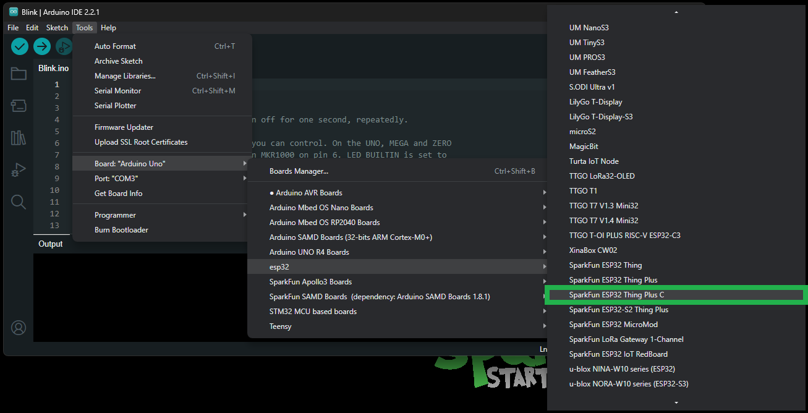
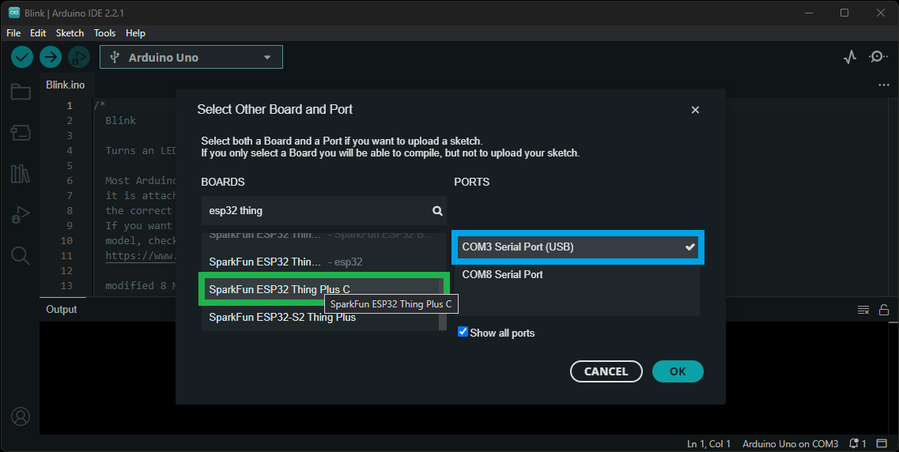
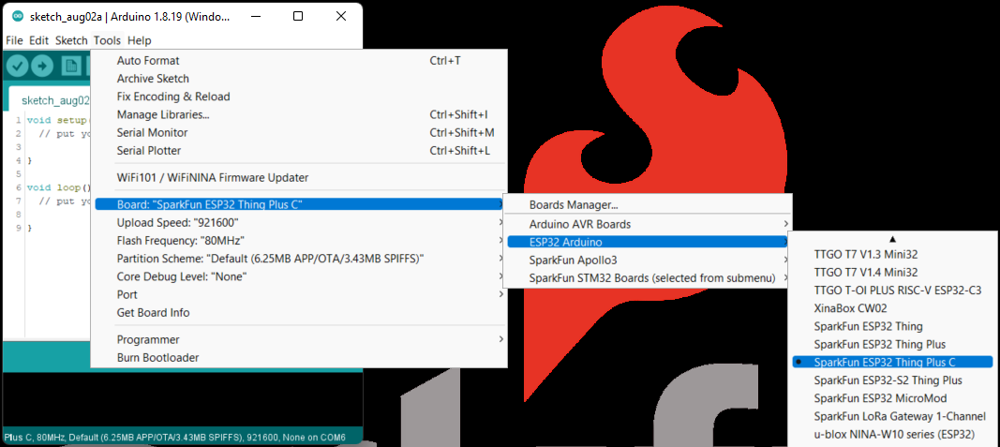
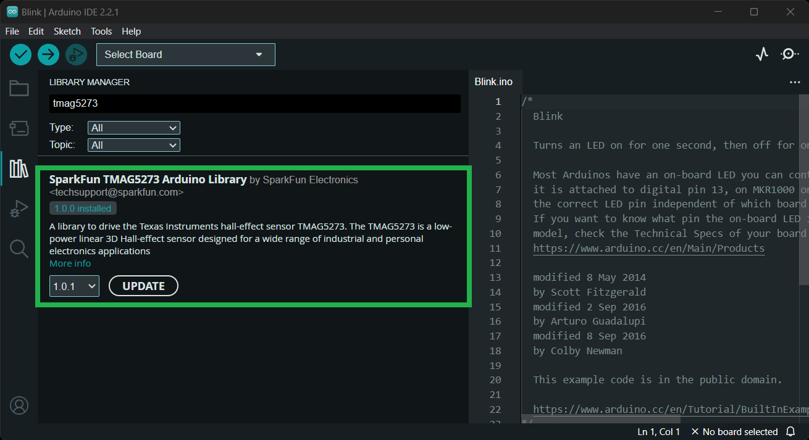
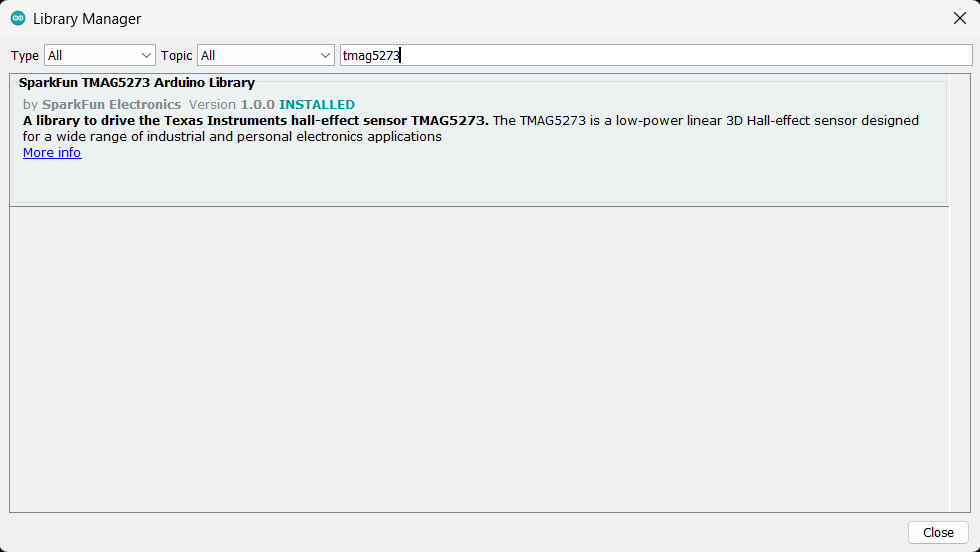
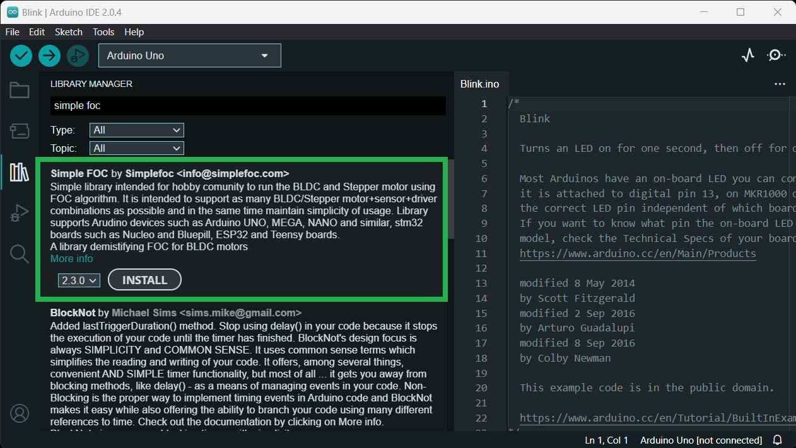
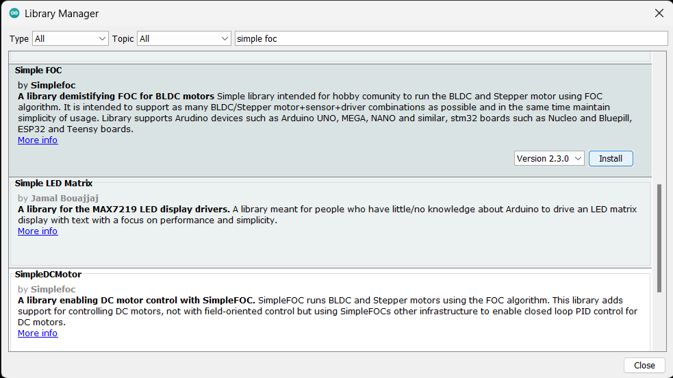

## CH340 Driver
Users will need to install the appropriate driver for their computer to recognize the serial-to-UART chip on their board/adapter. Most of the latest operating systems will recognize the CH340C chip on the board and automatically install the required driver.

*To manually install the CH340 driver on their computer, users can download it from the [WCH website](http://www.wch-ic.com/products/CH340.html?). For more information, check out our [How to Install CH340 Drivers Tutorial](https://www.sparkfun.com/ch340).*

<figure markdown>
[](https://learn.sparkfun.com/tutorials/908)
<figcaption markdown>[**How to Install CH340 Drivers**](https://learn.sparkfun.com/tutorials/908)</figcaption>
</figure>


## Arduino IDE
!!! tip
	For first-time users, who have never programmed before and are looking to use the Arduino IDE, we recommend beginning with the <a href="https://www.sparkfun.com/products/15631">SparkFun Inventor's Kit (SIK)</a>, which is designed to help users get started programming with the Arduino IDE.

Most users may already be familiar with the Arduino IDE and its use. However, for those of you who have never heard the name *Arduino* before, feel free to check out the [Arduino website](https://www.arduino.cc/en/Guide/HomePage). To get started with using the Arduino IDE, check out our tutorials below:


<div class="grid cards" markdown align="center">

-   <a href="https://learn.sparkfun.com/tutorials/50"><figure markdown>
	
	</figure>

	---

	**What is an Arduino?**</a>

-   <a href="https://learn.sparkfun.com/tutorials/61"><figure markdown>
	
	</figure>

	---
	
	**Installing the Arduino IDE**</a>

-   <a href="https://learn.sparkfun.com/tutorials/15"><figure markdown>
	
	</figure>

	---
	
	**Installing an Arduino Library**</a>

-   <a href="https://learn.sparkfun.com/tutorials/1265"><figure markdown>
	
	</figure>

	---
	
	**Installing Board Definitions in the Arduino IDE**</a>
</div>

### Install Board Definition
Install the latest <b>ESP32</b> board definitions in the Arduino IDE.

<center>
[](https://learn.sparkfun.com/tutorials/1265)<br>
[**Installing Board Definitions in the Arduino IDE**](https://learn.sparkfun.com/tutorials/1265)
</center>


!!! info
	For more instructions, users can follow this tutorial on [Installing Additional Cores](https://docs.arduino.cc/learn/starting-guide/cores) provided by Arduino. Users will also need the `.json` file for the Espressif Arduino core:

		https://raw.githubusercontent.com/espressif/arduino-esp32/gh-pages/package_esp32_index.json


When selecting a board to program in the Arduino IDE, users should select the **SparkFun ESP32 Thing Plus C** from the `Tools` drop-down menu _(_i.e. **Tools** > **Board** > **ESP32 Arduino** > **SparkFun ESP32 Thing Plus C**)._ Alternatively, users can also select the **ESP32 Dev Module**; however, they may lose some pin assignments.

<figure markdown>
[{ width="400" }](./assets/img/hookup_guide/board_selection.png)
<figcaption markdown>Select the **SparkFun ESP32 Thing Plus C** from the `Tools` drop-down menu in the Arduino IDE.</figcaption>
</figure>

??? info "Arduino IDE 2.x.x - *Alternative Method*"
	In the newest version of the Arduino IDE 2.`x`.`x`, users can also select their board (*green*) and port (*blue*) from the `Select Board & Port` dropdown menu (*yellow*).

	<figure markdown>
	[{ width="400" }](./assets/img/hookup_guide/board_selection-alt.png)
	<figcaption markdown>Selecting the **SparkFun ESP32 Thing Plus C** and **COM5** port from the **Select Board & Port** drop-down menu in the Arduino IDE (v2.0.3).</figcaption>
	</figure>


<!-- Comment Out

??? tip "Arduino IDE *(v1.x.x)*"
	In the Arduino IDE v1.x.x, users will select the **SparkFun ESP32 Thing Plus C** from the `Tools` drop-down menu _(_i.e. **Tools** > **Board** > **ESP32 Arduino** > **SparkFun ESP32 Thing Plus C**)._

	<figure markdown>
	[{ width="400" }](./assets/img/hookup_guide/board_selection-legacy.png)
	<figcaption markdown>Selecting the **SparkFun ESP32 Thing Plus C** from the **Tools** drop-down menu in the Arduino IDE (v1.8.19).</figcaption>
	</figure>
-->

## SparkFun TMAG5273 Arduino Library
The [SparkFun TMAG5273 Arduino Library](https://github.com/sparkfun/SparkFun_TMAG5273_Arduino_Library) can be installed from the library manager in the Arduino IDE.

<figure markdown>
[{ width="400" }](./assets/img/hookup_guide/TMAG5273_library.png)
<figcaption markdown>SparkFun TMAG5273 Arduino library in the library manager of the Arduino IDE.</figcaption>
</figure>

??? tip "Arduino IDE *(v1.x.x)*"
	In the Arduino IDE v1.x.x, the library manager will have the following appearance for the SimpleFOC library:

	<figure markdown>
	[{ width="400" }](./assets/img/hookup_guide/TMAG5273_library-legacy.png)
	<figcaption markdown>SparkFun TMAG5273 Arduino library in the library managerof the Arduino IDE (v1.x.x).</figcaption>
	</figure>

This library will be primarily used to interact with the TMAG5273 hall-effect sensor and return the rotation angle of the motor.


## SimpleFOC Arduino Library
The [Simple Field Oriented Control Library](https://github.com/simplefoc/Arduino-FOC) can be installed from the library manager in the Arduino IDE.

<figure markdown>
[{ width="400" }](./assets/img/hookup_guide/FOC_library.png)
<figcaption markdown>SimpleFOC library in the library manager of the Arduino IDE.</figcaption>
</figure>

??? tip "Arduino IDE *(v1.x.x)*"
	In the Arduino IDE v1.x.x, the library manager will have the following appearance for the SimpleFOC library:

	<figure markdown>
	[{ width="400" }](./assets/img/hookup_guide/FOC_library-legacy.png)
	<figcaption markdown>SimpleFOC library in the library manager of the Arduino IDE (v1.x.x).</figcaption>
	</figure>

This library utilizes a motor control scheme called field oriented control (FOC), which can utilize a feedback control loop to drive a motor with a higher power efficiency and precision characteristics, like evenly distributed torque control.

!!! info
	For more details about the library, check out the [online documentation](https://docs.simplefoc.com/).

!!! note "Supported Hardware"
	For a detailed and up-to-date list of the hardware supported by this library, check out the [library's documentation](https://docs.simplefoc.com/supported_hardware). The following are excerpts taken from the library's documentation page:

	=== "Microcontrollers"

		--8<-- "https://raw.githubusercontent.com/simplefoc/simplefoc.github.io/master/docs/simplefoc_library/hardware/mcus/index.md:14:15"

		--8<-- "https://raw.githubusercontent.com/simplefoc/simplefoc.github.io/master/docs/simplefoc_library/hardware/mcus/index.md:35:49"

		!!! info
			For more details, please refer to the [SimpleFOC Arduino library documentation](https://docs.simplefoc.com/microcontrollers).
	
	=== "Motor Drivers"

		--8<-- "https://raw.githubusercontent.com/simplefoc/simplefoc.github.io/master/docs/simplefoc_library/hardware/drivers/index.md:19:23"

		??? warning "Current Limitations"
			--8<-- "https://raw.githubusercontent.com/simplefoc/simplefoc.github.io/master/docs/simplefoc_library/hardware/drivers/index.md:30"

		!!! tip
			While the TMC6300 isn't directly listed as part of the supported hardware for the SimpleFOC Arduino library, we have verified that is compatible with the library.

		!!! info
			For more details, please refer to the [SimpleFOC Arduino library documentation](https://docs.simplefoc.com/bldc_drivers).

	=== "Motors"

		Arduino SimpleFOClibrary supports two types of BLDC motors:

		- BLDC motors
			- 3 phase (3 wire):

				??? info "Gimbal Motors"
					--8<-- "https://raw.githubusercontent.com/simplefoc/simplefoc.github.io/master/docs/simplefoc_library/hardware/motors/BLDC_motors.md:20:22"

					--8<-- "https://raw.githubusercontent.com/simplefoc/simplefoc.github.io/master/docs/simplefoc_library/hardware/motors/BLDC_motors.md:23:28"

				??? info "High-performance Motors"		
					--8<-- "https://raw.githubusercontent.com/simplefoc/simplefoc.github.io/master/docs/simplefoc_library/hardware/motors/BLDC_motors.md:43:43"
		- Stepper motors
			- 2 phase (4 wire)
	
		??? warning "Current Limitations"
			--8<-- "https://raw.githubusercontent.com/simplefoc/simplefoc.github.io/master/docs/simplefoc_library/hardware/motors/index.md:28"

		!!! info
			For more details, please refer to the [SimpleFOC Arduino library documentation](https://docs.simplefoc.com/bldc_motors).


### 6PWM Motor Driver

Users will need to utilize the [`BLDCDriver6PWM` class](https://docs.simplefoc.com/bldcdriver6pwm) to provide the six PWM signals required for the TMC6300 motor driver.

`BLDCDriver6PWM`

:   This class provides an abstraction layer for most of the common BLDC drivers, which require six PWM signals. This method offers more control than a three PWM motor drivers, since each of the 6 half-bridges MOSFETs can be controlled independently.

	--8<-- "https://raw.githubusercontent.com/simplefoc/simplefoc.github.io/master/docs/simplefoc_library/code/drivers/bldc_driver/bldc_driver_6pwm.md:28:36"

	!!! note "Microcontroller Considerations"
		=== "Arduino Uno"
			--8<-- "https://raw.githubusercontent.com/simplefoc/simplefoc.github.io/master/docs/simplefoc_library/code/drivers/bldc_driver/bldc_driver_6pwm.md:42:50"

		=== "STM32"
			--8<-- "https://raw.githubusercontent.com/simplefoc/simplefoc.github.io/master/docs/simplefoc_library/code/drivers/bldc_driver/bldc_driver_6pwm.md:54:54"

			--8<-- "https://raw.githubusercontent.com/simplefoc/simplefoc.github.io/master/docs/simplefoc_library/code/drivers/bldc_driver/bldc_driver_6pwm.md:55:56"

			<div class="grid cards" markdown>

			-   **Hardware PWM**

				---

				--8<-- "https://raw.githubusercontent.com/simplefoc/simplefoc.github.io/master/docs/simplefoc_library/code/drivers/bldc_driver/bldc_driver_6pwm.md:59:69"

			-   **Software PWM**

				---

				--8<-- "https://raw.githubusercontent.com/simplefoc/simplefoc.github.io/master/docs/simplefoc_library/code/drivers/bldc_driver/bldc_driver_6pwm.md:72:93"

			</div>

		=== "ESP32"
			--8<-- "https://raw.githubusercontent.com/simplefoc/simplefoc.github.io/master/docs/simplefoc_library/code/drivers/bldc_driver/bldc_driver_6pwm.md:96:96"

	!!! info
		For more details about the `BLDCDriver6PWM` class, check out the [online documentation](https://docs.simplefoc.com/bldcdriver6pwm).

<!-- 
The PWM carrier frequency used to control the motor driver can greatly affect its efficiency.

* Low frequency - poor current shape, which increased heating and harmonics loss in the motor
* High frequency - increased transistor switching loss -->

### BLDC Motor

All BLDC motors are handled with the [`BLDCMotor` class](https://docs.simplefoc.com/bldcmotor).

`BLDCMotor`

:   This class implements the BLDC FOC algorithm, motion control loops, and monitoring.

	--8<-- "https://raw.githubusercontent.com/simplefoc/simplefoc.github.io/master/docs/simplefoc_library/code/motors/bldc_motors.md:23:30"

	!!! note "Motor Considerations"
		While, the datasheet for our [gimbal motor](https://www.sparkfun.com/products/20441), indicates that there are **8 pole pairs**, we have found that the motor operates more smoothly if the `BLDCMotor` class is instantiated with **7 pole pairs** instead.

		```cp
		BLDCMotor motor = BLDCMotor(7);
		```

	!!! info
		For more details about the `BLDCMotor` class, check out the [online documentation](https://docs.simplefoc.com/bldcmotor).


### Position Sensor
In order to incorporate the TMAG5273 hall-effect sensor into the FOC algorithm, users will need to utilize the [`GenericSensor` class](https://docs.simplefoc.com/generic_sensor).

`GenericSensor`

:   This class allows users to link a custom position sensor *(not already implemented in the SimpleFOC library)* by incorporating a few functions into their sketch.

	1. Implement two functions; one to initialize the TMAG5273 and another to read and return the sensor's current position.

		--8<-- "https://github.com/simplefoc/simplefoc.github.io/raw/master/docs/simplefoc_library/code/sensors/generic.md:29:33"

		--8<-- "https://github.com/simplefoc/simplefoc.github.io/raw/master/docs/simplefoc_library/code/sensors/generic.md:20:26"

	2. Instantiate the `GenericSensor` class and initialize the class by providing it pointers to the two functions.

		--8<-- "https://github.com/simplefoc/simplefoc.github.io/raw/master/docs/simplefoc_library/code/sensors/generic.md:37:42"

	3. There are two ways to use sensors implemented within the SimpleFOC library:
		* As standalone position sensor
			* In this configuration users would simply read the sensor's position, independently from incorporating the readings into the FOC algorithm.
		* Incorporate it as the motor position sensor for FOC algorithm

			1. Initialize the sensor in the `setup()` loop:

				```cpp
				--8<-- "https://github.com/simplefoc/simplefoc.github.io/raw/master/docs/simplefoc_library/code/sensors/generic.md:88:97"
				```

			2. Link the sensor in the `setup()` loop:

				```cpp
				--8<-- "https://github.com/simplefoc/simplefoc.github.io/raw/master/docs/simplefoc_library/code/sensors/generic.md:138:147"
				```


!!! info
	For more instructions on incorporating the `GenericSensor` class, please refer to the [SimpleFOC documentation](https://docs.simplefoc.com/generic_sensor).


### In-line Current Sensing
In order to incorporate the current sensing into the FOC algorithm, users will need to utilize the [`InlineCurrentSense` class](https://docs.simplefoc.com/inline_current_sense).

`InlineCurrentSense`

:   This class allows users to link a custom position sensor *(not already implemented in the SimpleFOC library)* by incorporating a few functions into their sketch.

	1. Instantiate the `InlineCurrentSense` class and initialize the class by providing the hardware configuration.

		--8<-- "https://github.com/simplefoc/simplefoc.github.io/raw/master/docs/simplefoc_library/code/current_sense/inline.md:38:46"

	2. Incorporate the current sensor into the FOC algorithm:

		1. Initialize the sensor in the `setup()` loop:

			--8<-- "https://github.com/simplefoc/simplefoc.github.io/raw/master/docs/simplefoc_library/code/current_sense/inline.md:100:103"

		2. Link the sensor to the motor driver in the `setup()` loop:

			--8<-- "https://github.com/simplefoc/simplefoc.github.io/raw/master/docs/simplefoc_library/code/current_sense/inline.md:126:129"
		
		2. Link the sensor to the motor in the `setup()` loop:

			--8<-- "https://github.com/simplefoc/simplefoc.github.io/raw/master/docs/simplefoc_library/code/current_sense/inline.md:138:141"

		--8<-- "https://github.com/simplefoc/simplefoc.github.io/raw/master/docs/simplefoc_library/code/current_sense/inline.md:145:168"


!!! info
	For instructions on incorporating the `InlineCurrentSense` class, please refer to the [SimpleFOC documentation](https://docs.simplefoc.com/inline_current_sense).


<!-- ### Motion Control

Unless a feedback loop is incorporated when driving the motor *(i.e. with [position sensors](https://docs.simplefoc.com/sensors) or [current sensing](https://docs.simplefoc.com/current_sense))*, users should implement the SimpleFOC library using the [open-loop control](https://docs.simplefoc.com/open_loop_motion_control).

Open-Loop Motion Control Types:

* [Velocity](https://docs.simplefoc.com/velocity_openloop)
* [Position](https://docs.simplefoc.com/angle_openloop) -->


<!-- #### Sensorless FOC
Current measurement

#### Closed-Loop
With position sensors

Control Types (available in library):
* Torque
* Velocity
* Angle

#### Low-side current sensing

While the SimpleFOC Arduino library offers the option to incorporate low-side current sensors into the feedback loop, 


--8<-- "https://raw.githubusercontent.com/simplefoc/simplefoc.github.io/master/docs/simplefoc_library/code/drivers/bldc_driver/bldc_driver_6pwm.md:101:110"


utilizing the [open loop example](https://github.com/simplefoc/Arduino-FOC/blob/master/examples/motion_control/open_loop_motor_control/open_loop_velocity_example/open_loop_velocity_example.ino) combined with the [6 channel PWM method](https://docs.simplefoc.com/bldcdriver6pwm) and *every* PWM pin on the Arduino Uno gets this board working. Note the [pairs of PWM pins](https://docs.simplefoc.com/bldcdriver6pwm) that must be used. -->